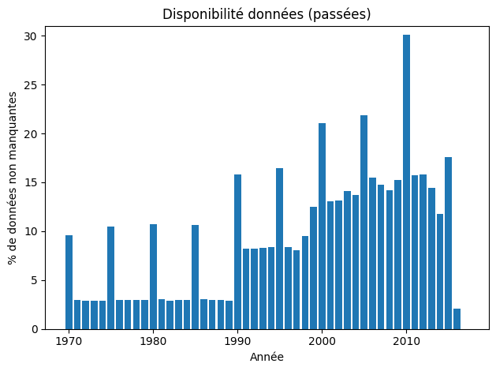
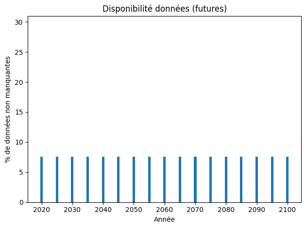
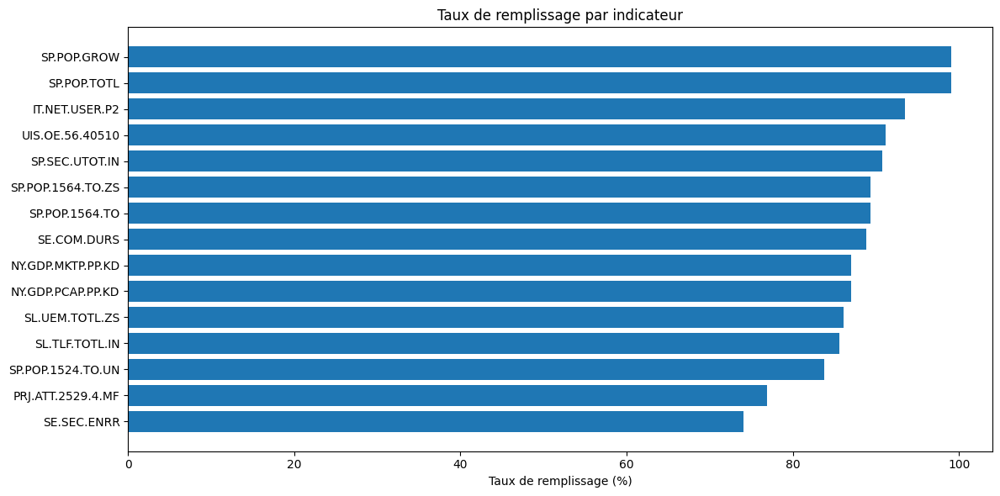
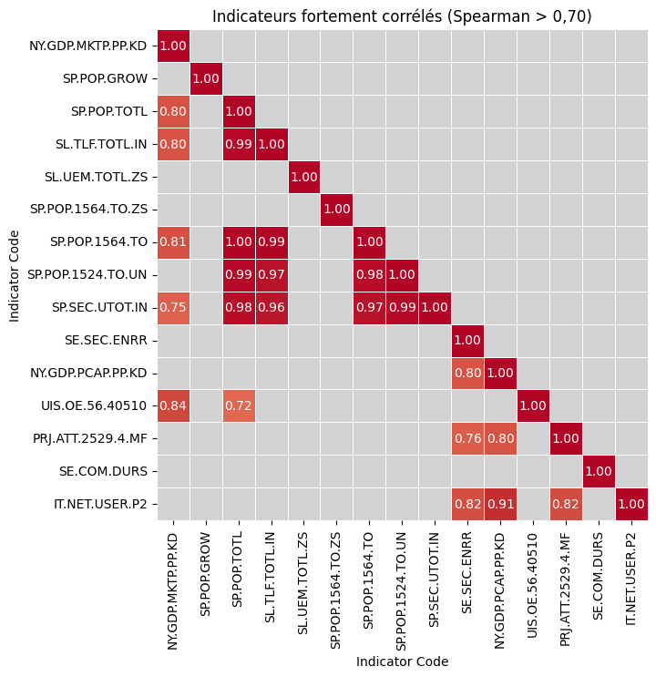
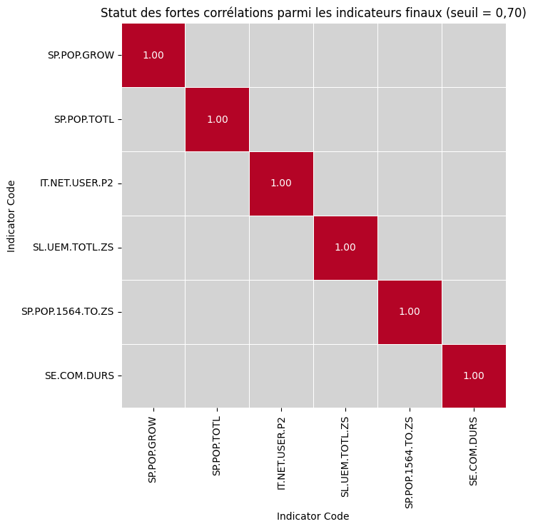
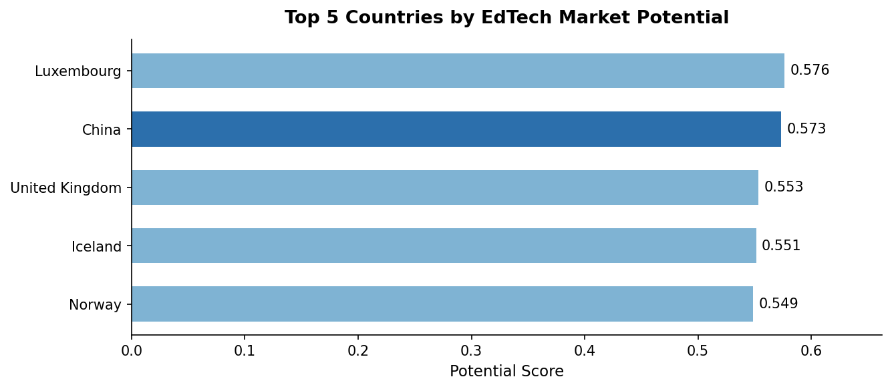

# Quantitative Market Scoring for EdTech International Expansion

> **Turning 886,930 rows of World Bank data into 5 actionable market recommendations.**

[](https://python.org)
[](https://jupyter.org)
[](https://pandas.pydata.org)
[](https://python-poetry.org)

---

## 🎯 The Challenge

**Simulated business case — "Academy"** is a fictional EdTech startup offering online courses for high school and university students. Facing a strategic expansion decision, the data team received the following mandate:

> *"Which countries have the highest potential student base for our platform — and how will that potential evolve?"*

The raw material: the **World Bank EdStats dataset** — 5 CSV files, **886,930 rows** in the main file alone, and **3,665 indicators** covering every measurable dimension of global education from 1970 to 2100. No pre-selection, no pre-defined targets.

---

## 💡 The Solution & Architecture

The core problem wasn't the analysis itself — it was **taming the scope**. A 3-stage filtering pipeline reduced 3,665 indicators to 6 statistically independent, business-relevant signals, then scored every country on a weighted composite index.


### Stage 1 — Business Filter
Retained only indicator categories directly relevant to the EdTech business question:
- **Infrastructure / Communications** — *Can users actually connect to our platform?*
- **Health / Population Dynamics** — *Is the target youth market growing?*
- **Education Expenditures** — *Do societies already invest in education?*

### Stage 2 — Data Quality Filter

The dataset contains projections up to **year 2100**, stored in the exact same format as real observed data. Without profiling, these hypothetical values would have silently polluted the analysis.

**Decision:** Excluded all future projections (2020–2100). Focused exclusively on observed, historical data. The **2013–2017 window** delivered the best balance between recency and completeness.




Ranked remaining indicators by average fill rate over 2013–2017. Selected the **top 15 most data-rich** indicators.



### Stage 3 — Statistical Filter

Applied **Spearman correlation** to detect redundancy. Any pair with |r| > 0.70 was flagged; the less business-relevant indicator was dropped.




**6 final independent indicators:**

| Code | Meaning | Weight in score |
|------|---------|-----------------|
| `IT.NET.USER.P2` | Internet users per 100 people | **35%** — eliminatory criterion |
| `SP.POP.TOTL` | Total population | **25%** — total addressable market |
| `SP.POP.1564.TO.ZS` | Population ages 15–64 (%) | **15%** — future student pool |
| `SP.POP.GROW` | Annual population growth (%) | **15%** — market dynamism |
| `SE.COM.DURS` | Duration of compulsory education (years) | **10%** — education culture proxy |
| `SL.UEM.TOTL.ZS` | Unemployment rate | **Excluded** — ambiguous signal |

> `SL.UEM.TOTL.ZS` was deliberately excluded from scoring: it can indicate both instability (risk) and demand for retraining (opportunity). Including it would have introduced noise rather than signal.

### Scoring Model

Each country received a **weighted potential score** via a normalized weighted average of the 5 retained indicators. Each indicator was normalized using `MinMaxScaler` from Scikit-learn to ensure that metrics with vastly different scales (e.g., percentages vs. hundreds of millions of people) contribute proportionally to the final score.



### Results: Two Strategic Market Profiles

| Profile | Countries | Key driver |
|---------|-----------|------------|
| **Volume market** | China | Colossal population — even a tiny market share represents massive absolute revenue |
| **Quality markets** | Luxembourg, UK, Iceland, Norway | Very high internet penetration + strong education culture — easier to convert, higher lifetime value |

The scoring model is **fully parameterized**: weights and thresholds are defined as variables in the notebook, making it trivial to re-run for a Top 10 or Top 20 or with alternative strategic assumptions.

---

## 🛠️ Tech Stack

| Layer | Tool |
|-------|------|
| Language | Python 3.13 |
| Data manipulation | Pandas 2.x, NumPy 2.x |
| Visualization | Seaborn, Matplotlib |
| Missing data viz | Missingno |
| Notebook | JupyterLab |
| Environment management | Poetry |
| Normalization | Scikit-learn (`MinMaxScaler`) |
| Custom toolkit | `academy_toolkit` (local package) |

---

## 🚀 How to Run

### Option A — Poetry (recommended)

**Prerequisites:** Python ≥ 3.10, [Poetry installed](https://python-poetry.org/docs/#installation).

```bash
# 1. Clone
git clone https://github.com/abguven/edtech-market-expansion-eda.git
cd edtech-market-expansion-eda/academy

# 2. Install dependencies + local toolkit
poetry install

# 3. Launch JupyterLab
poetry run jupyter lab
```

Open `notebooks/analysis.ipynb` and run all cells.

### Option B — Docker (no local Python setup required)

```bash
git clone https://github.com/abguven/edtech-market-expansion-eda.git
cd edtech-market-expansion-eda/academy

# Build the image (installs Poetry, dependencies, and academy_toolkit)
docker build -t edtech-eda .

# Run — mount your local data folder so the notebook can read the CSVs
docker run --rm -p 8888:8888 \
  -v "$(pwd)/data":/app/academy/data \
  edtech-eda
```

Open the URL printed in the terminal, navigate to `notebooks/analysis.ipynb`.

### Data Setup (both options)

The World Bank EdStats dataset (~350 MB) is not tracked by git. Download it from the **[World Bank Open Data portal](https://datacatalog.worldbank.org/search/dataset/0038480)** and place the 5 CSV files in `academy/data/`:

```
academy/data/
├── EdStatsCountry.csv
├── EdStatsCountry-Series.csv
├── EdStatsData.csv          ← main file, ~312 MB
├── EdStatsFootNote.csv
└── EdStatsSeries.csv
```

---

## 🧠 Technical Challenges Overcome

### 1. Future Projections Hidden Inside Historical Data
The EdStats dataset stores year-2100 projections in the exact same schema as real observations — with no flag differentiating them. Blindly using all years would have silently skewed the analysis with hypothetical data. **Solution:** profiled fill rates by year, which revealed a structural break at 2018 where completeness collapses from ~30% to ~7%. Everything from 2020 onwards was excluded.

### 2. Reducing 3,665 Indicators to a Non-Redundant Shortlist
Manual review of 3,665 indicators is not feasible. **Solution:** built a systematic 3-stage pipeline — business relevance → data completeness → statistical independence. Each decision is documented and reproducible. The funnel went 3,665 → ~200 → 15 → 6, with every cut justified.

### 3. "Fake Countries" Contaminating the Country Dimension
`EdStatsCountry` contains regional and income-group aggregates ("World", "Sub-Saharan Africa", "Low income", etc.) alongside sovereign nations. Including them would have inflated population and demographic metrics. **Solution:** filtered using the `Region` column (aggregates have no region assigned), then validated consistency via an inner join across all related dataframes.

### 4. Building a Transparent, Defensible Scoring Model
Collapsing multi-dimensional country profiles into a single score requires subjective weighting choices. Left undocumented, this becomes a black box that stakeholders can't challenge or adjust. **Solution:** every weight is explicitly justified in the notebook (e.g., internet access at 35% as a hard prerequisite; unemployment excluded due to interpretive ambiguity). The model is parameterized — changing a weight is a one-line edit.

### 5. Missing Values Without Imputation
Even after the 3-stage filter, several country-indicator combinations had missing years within the 2013–2017 window. **Solution:** used **temporal aggregation** (mean per country-indicator pair across available years) rather than imputation. Countries with fewer than 2 valid years for a given indicator were flagged but retained, keeping the dataset honest rather than artificially complete.

---
